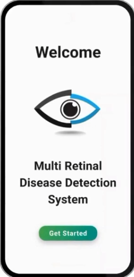
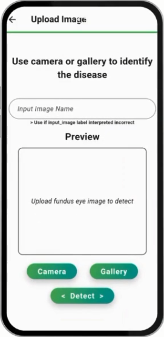
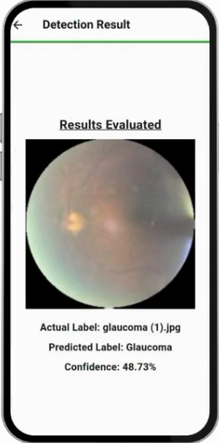

# Eye Scan DL

A Flutter application for multi-class retinal disease detection from fundus eye images. The app lets users capture or select an image, runs a TensorFlow Lite model locally, and displays the predicted disease label with a confidence score.

## Screenshots

| Welcome | Upload | Result |
| --- | --- | --- |
|  |  |  |

## Features

- Gallery image input, Camera input is not applicable (requires sensor)
- Local TensorFlow Lite inference
- Retinal fundus image validation threshold
- Prediction result with confidence percentage
- Simple Flutter UI for mobile and desktop targets

## Project Structure

- `lib/` - Flutter UI and inference flow
- `assets/class_labels.json` - model output labels
- `assets/model.tflite` - local model file, intentionally not tracked because it is large
- `screenshots/` - README screenshots

## Setup

1. Install Flutter and verify it with `flutter doctor`.
2. Run `flutter pub get`.
3. Add the trained model file at `assets/model.tflite`.
4. Run the app with `flutter run`.

## Notes

The TensorFlow Lite model is excluded from Git because it is about 83 MB. Keep a local copy at `assets/model.tflite` before running inference.
